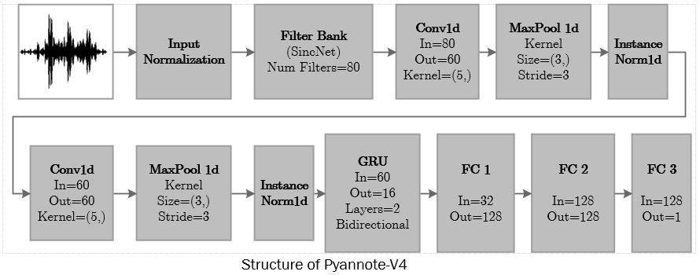
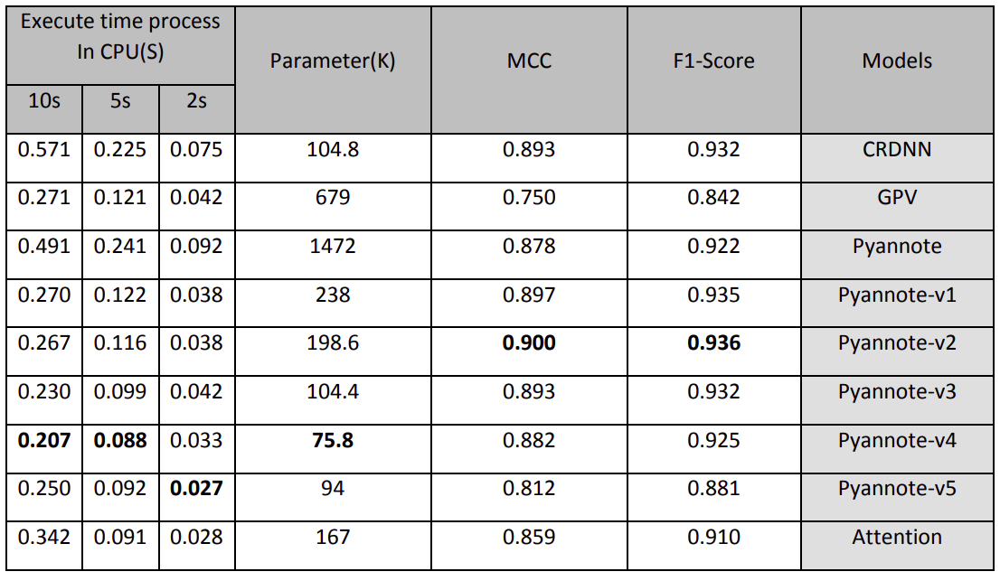

# Electronics Research Institute, Sharif University of Technology

## Voice Activity Detection Project

## Table of Contents
- [Dataset](#Dataset)
- [Pyannote-v2](#Pyannote-v2)
- [Pyannote-v4](#Pyannote-v4)
- [Other versions of Pyannote](#other-versions-of-pyannote)
- [Quick-Installation-Usage](#Quick-Installation-Usage)
- [Results](#Results) 


# Dataset 


**Note1: For train, test, and evaluation of model, you should put unzipped data in [**Noisy_Dataset_V1**](./dataset/Noisy_Dataset_V1) and  [**Noisy_Dataset_V2**](./dataset/Noisy_Dataset_V2).**

**Note2: For running the codes, it is necessary to unzip test_filenames.zip, valid_filenames.zip, train_filenames_v2.zip, and VadLabel.zip files in this [**folder**](./dataset)**

**Note3: For each specific dataset, it is necessary to create train_filenames_v2.csv, test_filenames.csv, and valid_filenames.csv based on the path of your dataset in this [**folder**](./dataset).**

This [**folder**](./dataset) contains the project dataset for Voice Activity Detection.
<div align="justify"> In this project, around 4.6 millions mp3 files of data have been collected from noiseless Persian language and noise dataset. To create the noisy data, QUT dataset and the noisy data delivered from the employer were used as the pure noise dataset. The QUT dataset contains 5 different types of noise (home, cafe, street, etc.). 
To create VAD dataset, at first, a part of the Common Voice dataset was separated as bellow:
 
- Separating the validated section from the invalidated section.
- Separating the part that does not have a negative vote from the evaluation candidates and has at least one positive vote.
- Separating the part that is recognized by the internal model of the technical team for speech diagnosis completely.

After selecting the speech parts according to the above three criteria, we use the internal model of the technical team to segment the speech file. This model creates one character per frame of 20 milliseconds of input sound, and therefore we can assign speech and non-speech label to each frame. The data created by the above procedure constitutes the noise-free part of the DS-Fa-V01 and DS-Fa-V03 dataset. In this project, post-processing can be used to repair the gap between speech labels.


As a result, the noise-free part is gained from the DS-Fa-V02 dataset. To create noise samples in both dataset, the real QUT noise data and noise data created by the respected employer were used. For this reason, the noise-free part of two dataset DS-Fa-V01, DS-Fa-V02 and DS-Fa-V03 with different SNRs from **-2**to **30**  dB with **2** steps with QUT data and from 0 to 30 dB with 10 steps with The employer-created noise was mixed. For DS-Fa-V03, we added extra employer-created noise levels such as 6, 8, 12, 14, ..., 18 and 25 dB to the noise-free part to rich the dataset. For each level (SNR), the entire VAD dataset was combined with the noise that was chosen randomly during mixing. The last version of the dataset (DS-Fa-V03) containing around 4.6 millions of labeled data. For segmenting the dataset into evaluation and test data, around 160 thousands of DS-Fa-V01 data, were separated and prepared with the corresponding noise data of evaluation and test data. The others were classified as train data. Therefore, there is no leakage of the audio files of the training set in the evaluation and test parts.


```
DS-Fa-V03
	├── -2dB 
	│   ├── common_voice_fa_18202356SPLITCAR-WINUPB-1SPLIT0dB.mp3
	│   ├── common_voice_fa_18202357SPLITCAFE-CAFE-1SPLIT0dB.mp3
	│   ├── common_voice_fa_18202375SPLITREVERB-CARPARK-2SPLIT0dB.mp3	 	 
	│   ├──    .
	│   ├──    .	 	 
	│   └── common_voice_fa_18202378SPLITCAFE-CAFE-1SPLIT0dB.mp3
	├── 0 dB 
	│   ├── common_voice_fa_18202356SPLITCAR-WINUPB-1SPLIT0dB.mp3
	│   ├── common_voice_fa_18202357SPLITCAFE-CAFE-1SPLIT0dB.mp3
	│   ├── common_voice_fa_18202375SPLITREVERB-CARPARK-2SPLIT0dB.mp3	 	 
	│   ├──    .
	│   ├──    .	 	 
	│   └── common_voice_fa_18202378SPLITCAFE-CAFE-1SPLIT0dB.mp3
        .
        .
        .
        .
	├── 30 dB 
	│   ├── common_voice_fa_18202356SPLITCAR-WINUPB-1SPLIT0dB.mp3
	│   ├── common_voice_fa_18202357SPLITCAFE-CAFE-1SPLIT0dB.mp3
	│   ├── common_voice_fa_18202375SPLITREVERB-CARPARK-2SPLIT0dB.mp3	 	 
	│   ├──    .
	│   ├──    .	 	 
	│   └── common_voice_fa_18202378SPLITCAFE-CAFE-1SPLIT0dB.mp3
	└── InfdB
	    ├── common_voice_fa_18202356SPLITCAR-WINUPB-1SPLIT0dB.mp3
	    ├── common_voice_fa_18202357SPLITCAFE-CAFE-1SPLIT0dB.mp3
	    ├── common_voice_fa_18202375SPLITREVERB-CARPARK-2SPLIT0dB.mp3	 	 
	    ├──    .
	    ├──    .	 	 
	    └── common_voice_fa_18202378SPLITCAFE-CAFE-1SPLIT0dB.mp3

```
## Data collection procedure

In this project,the CommonVoice Persian version 13 database has been used to build a proper VAD database in Persian language.
CommonVoice is an open source project started by Mozilla to collect speech data, where people can speak sentences.

```bibtex
@article{nezami2019shemo,
  title={ShEMO: a large-scale validated database for Persian speech emotion detection},
  author={Nezami, Omid Mohamad and Lou, Paria Jamshid and Karami, Mansoureh},
  journal={Language Resources and Evaluation},
  volume={53},
  number={1},
  pages={1--16},
  year={2019},
  publisher={Springer}
}
```

# Pyannote-v2

In this version, compared to the original model, uses two bidirectional GRU layers with 64 hidden units in its recurrent layer in order to simultaneously use the depth in its structure and reduce the number of parameters. The number of parameters of this model is about 199 thousand.

<p align="center"></p>


# Pyannote-v4

In this version, compared to the original model, the process of reducing the complexity continued by maintaining the depth in the recurrent layers, and the number of hidden units in the bidirectional GRU was considered equal to 16.

<p align="center"></p>

# Other versions of Pyannote

For other versions, we just changed the stride of filter bank block of the base model. For example, Pyannote-v2.2 has the base model of  Pyannote-v2 with a triple stride of the base model, and for Pyannote-v4.1, the base model is Pyannote-v4 with a double stride. The number of parameters of models is equal to the base model one.

# Quick-Installation-Usage
## Install

Once you have created your Python environment (Python 3.7+) you can simply type:

```
pip install -r requirements.txt
```

## Usage
### Train, Evaluate, Test and Deploy Model
#### 1. Run the following code with the desired settings to train the model: ####

```bash                  
python train.py -cfg [path to .json configuration file]
                -o   [path for saving model]
```
#### For example: ####

```bash                  
python train.py -cfg recipes/pyannote_v2.json
                -o checkpoints/Pyannote-v2.pth
```
	
#### 2. Run the following code with the desired settings to evaluate the model: ####

```bash
python evaluate.py -cfg [path to .json configuration file]
                   -i   [path to saved model]
```
#### For example: ####

```bash
python evaluate.py -cfg recipes/pyannote_v2.json
                   -i checkpoints/Pyannote-v2.pth
```

#### 3. Run the following code with the desired settings to inference the model: ####

```bash
python inference.py -cfg [path to .json configuration file]
                    -i   [path to saved model]
                    -w   [path to .wav file for testing]
```
#### For example: ####

```bash
python inference.py -cfg recipes/pyannote_v2.json
                    -i checkpoints/Pyannote-v2.pth
                    -w demo/sample.wav
```

#### 4. Run the following code with the desired settings to export the model to onnx: ####

```bash
python export_onnx.py -cfg [path to .json configuration file]
                      -i   [path to saved model] 
                      -o   [path for saving onnx file]
```
#### For example: ####

```bash
python export_onnx.py -cfg recipes/pyannote_v2.json
                      -i checkpoints/Pyannote-v2.pth 
                      -o checkpoints/Pyannote-v2.onnx
```

#### 5. Run the following code with the desired settings to inference the onnx model: ####

```bash
python inference_onnx.py -i [path to saved .onnx file]
                         -w [path to .wav file for testing]
```
#### For example: ####

```bash
python inference_onnx.py -i checkpoints/Pyannote-v2.onnx
                         -w demo/sample.wav
```

# Results
## Phase 1:
In this phase of project, the test results of proposed VAD checkpoints on DS-Fa-v01 test data is shown. please note that the results of the execuation time are on CPU with batch size of 50 and audio with duration of 2, 5 and 10 seconds.

<p align="center"></p>

## Phase 2:
In the phase 2 of project, the test results of proposed VAD checkpoints in this phase on DS-Fa-v03 test data is shown. please note that the results of the execuation time are on CPU with batch size of 50 and audio with duration of 2, 5 and 10 seconds.

<p align="center"></p>


