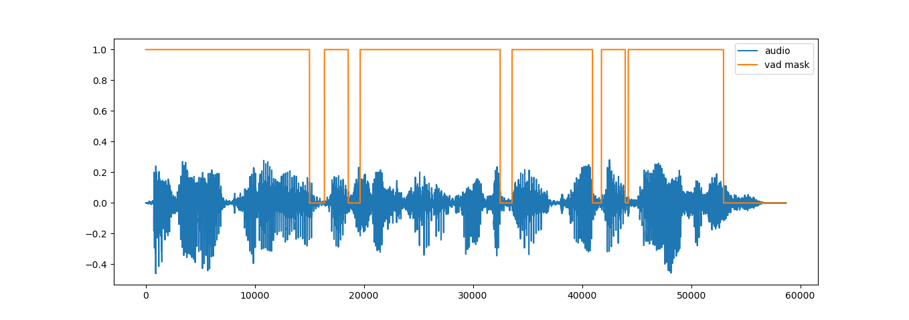

# Demo 

This [**folder**](../demo) shows the inference of our model on one test sample :

#### Run the following code with the desired settings to inference the model: ####

```bash
python inference.py -cfg [path to .json configuration file]
                    -i   [path to saved model]
                    -w   [path to .wav file for testing]
```
#### For example: ####

```bash
python inference.py -cfg ../recipes/pyannote_v2.json
                    -i  ../checkpoints/Pyannote-v2.pth
                    -w  sample.wav
```

<p align="center"></p>


